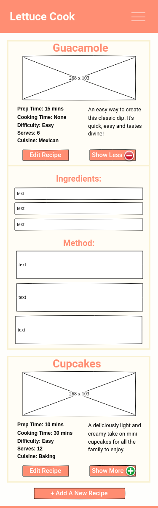
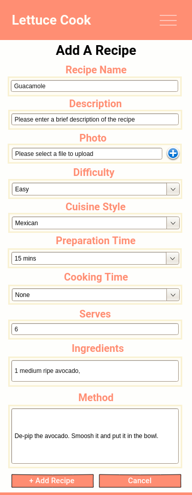
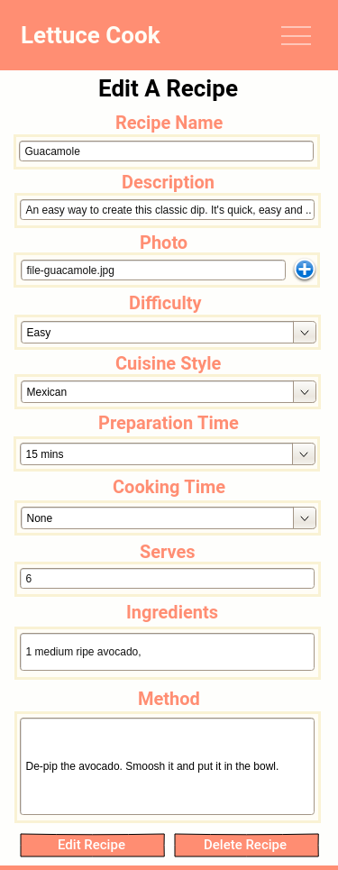
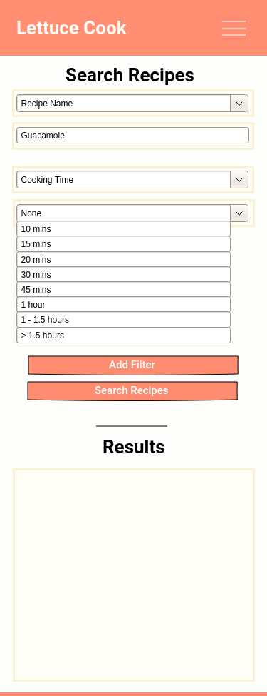
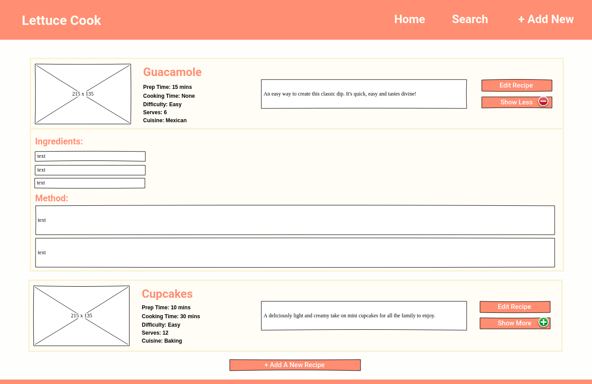
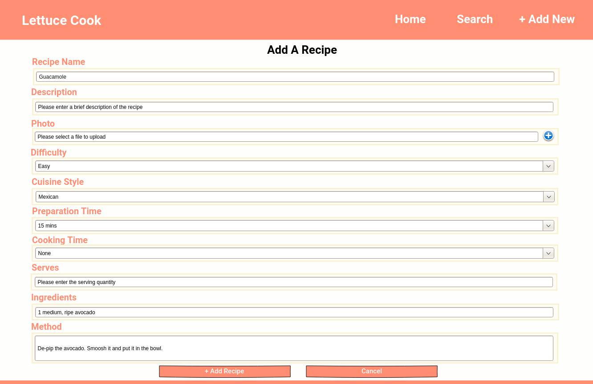
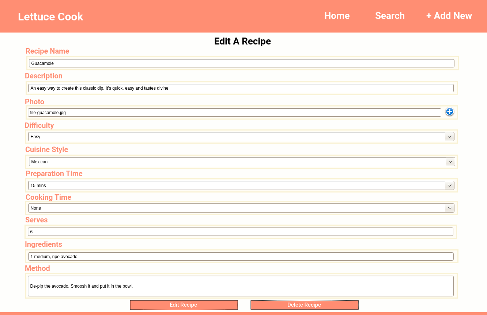
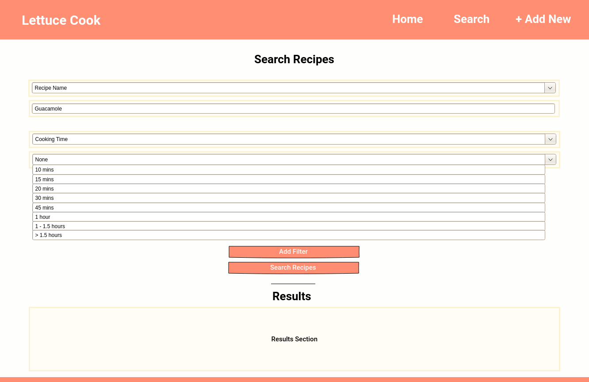

# Lettuce Cook
## Data Centric Development Milestone Project - Code Institute

The purpose of this site is to provide users a database of recipes which they can add to in order to have a collection of mixed recipes. A user can search for a particular recipe, add a recipe, edit a recipe, or delete the recipe. The landing page is the full collection of recipes in the database.
 
## UX

This website is designed to feel fresh and friendly, in order to appeal to both young and old users who want to add to a collection of recipes. 

#### Strategy
For potential users, the site is aimed at being able to add to the collection of recipes, edit any recipes in the collection, delete a recipe from the collection and to search through the collection of recipes. 
All these need to appear in an easy-to-read format, and intuitive organised layout that is easy for the user to navigate through. 
The home page will provide an interactive base with all the recipes showing, with links to the other actions to the collection.

For potential site owners, the site could be monitored to gauge how popular a certain style of cuisine is by how many views or recipes are added into that category. 

For all users, the site can be used to be a community-based collection of recipes that are easily shared with other users for everyone's cooking benefits. 
Multiple recipes from multiple sources can be viewed on one site, making amalgamating recipe collections more simple.

#### Scope
Key features to include are:
- A navigation panel which is collapsible for smaller screen sizes
- The add / edit pages to add or edit a recipe to or within the collection
- The delete option to be hidden within an edit page so no accidental removals occur
- Photos to have a visual aid to which recipes might appeal best to the users
- A search function with several categories, so the user can search for a particular item

#### Structure
The page will have a standard footer and header in the colour theme chosen. 
There are several pages to show:
- Home page to show the entire collection of recipes and give options to add / view / edit / delete recipes (CRUD functionality)
- Search page which allows the user to search the catalogue of recipes and view results
- New Recipe page - used to add a recipe to the collection
- Edit Recipe page - used to edit any existing recipes in the collection

#### Skeleton
I created an original skeleton page using Pencil software. The latest version of the skeleton can be found [here](static/mockups/wireframe.pdf). 

For ease of viewing, I have attached the main mockups below:
- Mobile Home page: 
    

- Mobile Add Recipe page: 
    

- Mobile Edit Recipe page: 
    

- Mobile Search Recipe page: 
    

- Web Home page: 
    

- Web Add Recipe page: 

- Web Edit Recipe page: 

- Web Search Recipe page: 

#### Surface
The colour scheme has been chosen to be welcoming, light and refreshing with positive colours, but without being garish. 
This will hopefully attract users of all ages without being hard to read. 

## Features
The majority of my website is built upon the grid system within Bootstrap, especially using the flex functionality. 
JavaScript and JQuery additions to Bootstrap allowed me to have a smoother drop down box which was collapsible for smaller screen sizes and a user friendly contact form. 
MongoDB Atlas was used as the hosting platform for the database used.
Heroku is the deployment host.

### Existing Features
- Dropdown menu - allows users to have a minimised menu for smaller screen sizes
- Form - allows users to input information into the database
- Interactive buttons to maximise use of the screen

### Features Left to Implement
- User-names so only the user who added the recipe can edit / remove that particular recipe
- Ratings for each recipe

## Technologies Used
- HTML 
    - The project uses **HTML5** as a base language for the webpage
- CSS 
    - The project is styled mainly using **CSS3** 
- [Bootstrap](https://getbootstrap.com/)
    - The project is structured using the **Bootstrap** grid system, implementing the flex attributes
- [JQuery](https://jquery.com)
    - The project uses **JQuery** to simplify DOM manipulation
- [JavaScript](https://www.javascript.com/)
    - The project uses **JavaScript** to make the functionality more smooth and interactive
- [Font Awesome](https://fontawesome.com/)
    - The project uses **Font Awesome** for icons within the webpage
- [MongoDB Atlas](https://www.mongodb.com/cloud/atlas)
    - The project hosts the database on **MongoDB Atlas** 
- [Heroku](https://www.heroku.com/)
    - The project is deployed from **Heroku** 

## Testing
Testing the search form:
- Attempt to submit an empty form to check an error message for the designated fields appears
- Check the functionality of the queries being sent to MongoDB
- Check that the results section show up "no results" if none are found

Testing the add functionality:
- Check that you can add to the database
- Check that the naming conventions are the same as the database or it will not show properly
- Send the correct data to the database
- Check you can receive the data from the database after adding

Checking using Validator:
- HTML validity was checked using the online validator [here](validator.w3.org)
- CSS was checked uing the online validator [here](http://www.css-validator.org/)

Screen sizes:
- The website was checked for all the screen sizes available on Chrome Developer Tools
- Special attention was shown for the mobile screen size as the recipe cards are different between the different sized screens
- Attention was taken for the iPad screens as the menu and photos needed manual styling

Browser details:
- All development was done within Chrome browser
- Mozilla was checked and the same functionality was found 
- Safari was also checked, but only in mobile view

Bugs found:
- Could not populate the data into the results section within the search page, so had to create a separate search results page with link back to the search page
- Interactive buttons to add fields to the html in the search filters section did not push the database variables to the javascript functions

## Deployment
This project has been deployed using Heroku. 

The process involved consists of:
- Adding regularly to the Git branch, committing with comments each time
- Pushing this Git branch to GitHub
- Pushing it to the Heroku branch
- Creating the necessary Procfile and requirements.txt files
- Deploying it from the Heroku webpage

## Credits
### Content
Text was written by me within the site. 

### Media
The photos used in the file system that I created were taken from Google Images under the "Labeled for Reuse" filter. 

### Acknowledgements
All elements which I have used within this page that were inspired by, or are from exteranl sources, are linked below:
- For the base information to create the flex system, I used [this page](https://getbootstrap.com/docs/4.0/utilities/flex/) as a reference
- For the layout for the recipe cards, I used [this page](https://getbootstrap.com/docs/4.1/utilities/display/) as a reference
- The dropdown menu was styled using the Bootstrap "navbar" item, found [here](https://getbootstrap.com/docs/4.0/components/navbar/)
- For extra help with the form to only send the desired values to the database, I used information from this [forum question](https://stackoverflow.com/questions/11556958/sending-data-from-html-form-to-a-python-script-in-flask)
